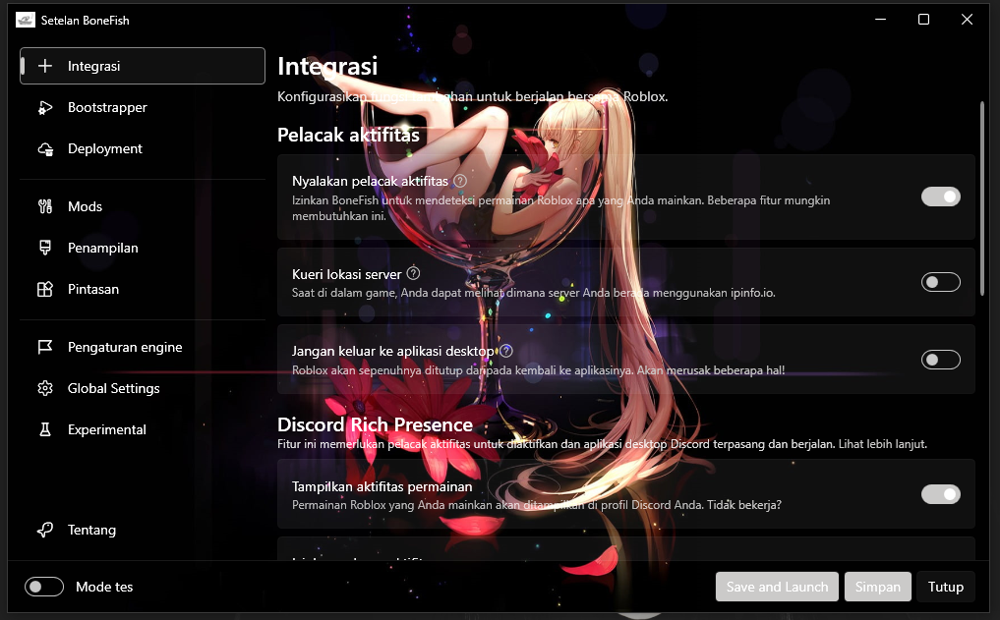
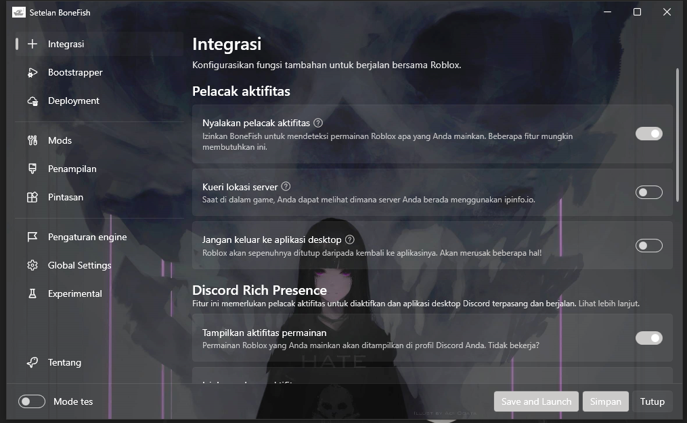
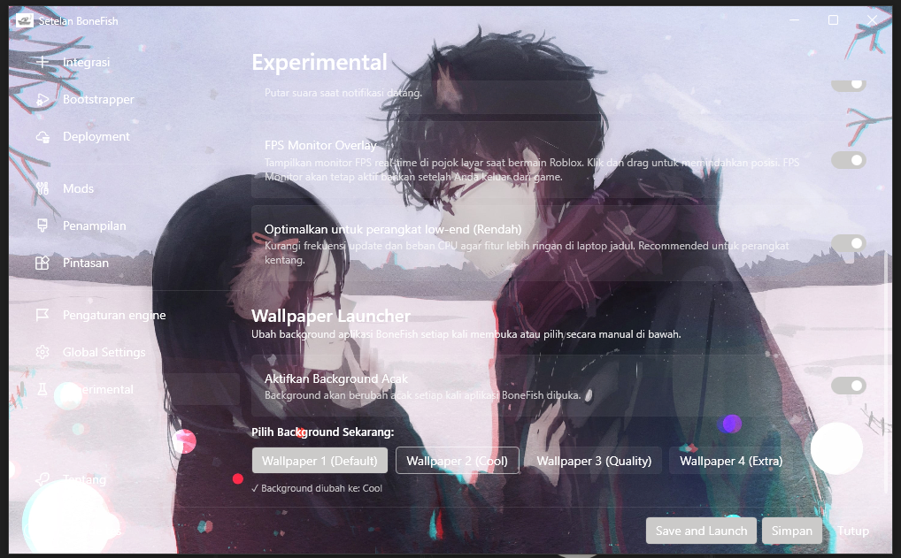
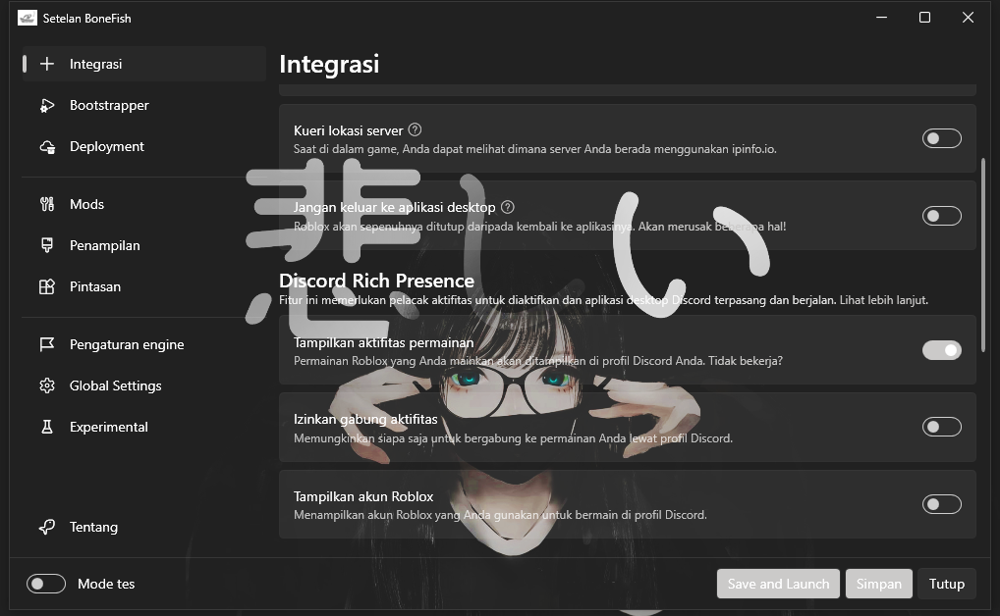

# BoneFish

**A Modern, Feature-Rich Roblox Bootstrapper**

[![License][badge-license]](#)
[![Build Status][badge-actions]](#)
[![Downloads][badge-downloads]][repo-latest]
[![Version][badge-latest]][repo-latest]
[![Discord][badge-discord]][discord-invite]
[![Stars][badge-stars]](#)

[Download Latest Release][repo-latest] · [Report Bug][repo-new-issue] · [Join Discord][discord-invite]

---

> [!WARNING]
> **Disclaimer:** This project (BoneFish) is a fork of [Bloxstrap][bloxstrap] → [Fishstrap][fishstrap] → **BoneFish**.  
> It is not affiliated with the original Bloxstrap or Fishstrap projects. Use at your own risk.

> [!CAUTION]
> **Official Download:** The only official place to download BoneFish is this GitHub repository.  
> Any other websites offering downloads or claiming to be us are **not controlled by us**.

---

## 🎯 About BoneFish

**BoneFish** (pronounced *bone-fish*) is a powerful custom bootstrapper for Roblox, built on the foundation of [Bloxstrap][bloxstrap] and [Fishstrap][fishstrap]. It's designed to enhance your Roblox experience with modern UI, advanced customization, and performance optimization tools.

> [!NOTE]
> BoneFish is an application for **Windows 10 and above**.  
> For other operating systems, check out [AppleBlox][appleblox] (Mac OS) and [Sober][sober] (Linux).

---

## ✨ Key Features

### 🎨 **Visual Customization**
- **Dynamic Background System** — Choose from 4 built-in wallpapers (Default, Cool, Quality, Extra) or enable random backgrounds on launch
- **Custom Loading Screens** — Upload your own images for a personalized loading experience
- **Modern UI** — Clean, fluent design with Inter font for better readability
- **Organized Sidebar** — Categorized navigation with visual separators

### ⚡ **Performance & Configuration**
- **FastFlags Editor** — Unhidden editor with direct preset controls:
  - Low-Spec mode for older devices
  - Balanced configuration
  - Performance mode for maximum FPS
  - Stability tweaks
- **Global Basic Settings** — Fine-tune frame rate caps, quality levels, and rendering options
- **FPS Monitor Overlay** — Real-time FPS display with draggable positioning (stays active even after game exit)

### 🔧 **Advanced Tools**
- **Detailed Server Information** — Powered by [RoValra][rovalra]'s API
- **Server History Tracking** — Keep track of servers you've joined
- **Roblox Studio Support** — Full bootstrapper support for Studio
- **Auto-Update System** — Automatic update checks with release notifications
- **Cache Cleaner** — One-click cleanup for Roblox cache
- **Channel Switcher** — Switch between Roblox deployment channels

### 🧪 **Experimental Features**
- **System Tray Integration** — Minimize to tray on close
- **Friend Online Notifications** — Get notified when friends come online (Windows native notifications)
- **Notification Sounds** — Audio alerts for notifications
- **Low-End Optimization** — Reduced update frequency for older hardware

---

## 📸 Showcase

### Default Interface

*Clean, modern settings panel with organized navigation*

---

### Mods & Customization

*Custom fonts, emojis, cursors, and loading screens*

---

### Visual Themes

*Multiple appearance options and bootstrapper styles*

---

### Experimental Features

*Advanced features: Wallpaper Launcher, FPS Monitor, Notifications*

---

## 🚀 Getting Started

### Installation

1. **Download** the latest release from [Releases][repo-latest]
2. **Extract** the ZIP file to a folder
3. **Run** `BoneFish.exe`
4. **Follow** the setup wizard
5. **Enjoy** your enhanced Roblox experience!

### System Requirements

- **OS:** Windows 10 (1809+) or Windows 11
- **Architecture:** x64 (64-bit)
- **.NET:** .NET 9.0 Runtime (auto-installed if missing)
- **Disk Space:** ~200 MB

---

## 📖 Usage Guide

### Wallpaper Launcher

Navigate to **Experimental** page to:
- **Toggle** random background changes on app launch
- **Select** from 4 wallpaper presets instantly
- Changes apply immediately without restart

### Custom Loading Screen

Go to **Mods** page to:
1. Click **Choose** under "Custom Loading Screen"
2. Select an image (PNG, JPG, JPEG, BMP)
3. Preview appears immediately
4. Click **Save** to apply

### FPS Monitor

Enable in **Experimental** page:
- Real-time FPS overlay in-game
- Drag to reposition
- Persists across game sessions

---

## 🔌 Hooks System

## 🎥 YouTube Content Script

BoneFish includes a detailed **YouTube content script** for creators who want to showcase the application.

📄 **[View Full Script](YOUTUBE-CONTENT-SCRIPT.md)**

The script includes:
- Complete video outline (15-20 minutes)
- Shot-by-shot breakdown with timestamps
- Voice-over suggestions in Indonesian
- B-roll requirements and editing tips
- Music recommendations
- Video description template with hashtags
- Thumbnail design tips

Perfect for creating professional tutorials and reviews!

---

## 🤝 Contributing

We welcome contributions! Here's how you can help:

1. **Fork** the repository
2. **Create** a feature branch (`git checkout -b feature/AmazingFeature`)
3. **Commit** your changes (`git commit -m 'Add some AmazingFeature'`)
4. **Push** to the branch (`git push origin feature/AmazingFeature`)
5. **Open** a Pull Request

### Contribution Guidelines

- Follow the existing code style
- Test your changes thoroughly
- Update documentation if needed
- Be respectful and constructive

---

## 🐛 Bug Reports & Support

Found a bug? Have a question?

- **GitHub Issues:** [Open an issue here][repo-new-issue]
- **Discord Support:** Join our [Discord server][discord-invite] and post in `#support-and-bugs`

When reporting bugs, please include:
- BoneFish version
- Windows version
- Steps to reproduce
- Error messages/screenshots
- Log files (if applicable)

---

## 🙏 Special Thanks

### Core Contributors
- **[pizzaboxer](https://github.com/pizzaboxer)** — Original creator of Bloxstrap
- **[Valra](https://github.com/NotValra)** — RoValra API for server information
- **[Fishstrap Team](https://github.com/fishstrap)** — Foundation for many features
- **[rsms](https://github.com/rsms)** — Inter font family

### Technology Stack
- **[WPF UI](https://github.com/lepoco/wpfui)** — Modern UI controls
- **[CommunityToolkit.Mvvm](https://github.com/CommunityToolkit/dotnet)** — MVVM framework
- **[AvalonEdit](https://github.com/icsharpcode/AvalonEdit)** — Code editor component
- **[DiscordRichPresence](https://github.com/Lachee/discord-rpc-csharp)** — Discord integration
- **[SharpVectors](https://github.com/ElinamLLC/SharpVectors)** — SVG rendering

### Community
- All contributors who submitted issues, PRs, and feedback
- Discord community members for testing and suggestions
- Everyone who uses and supports BoneFish

---

## 📜 License

This project is licensed under a custom BoneFish License.  
See the [LICENSE](LICENSE) file for details.

**TL;DR:**
- ✅ Free for personal use
- ✅ Modify and redistribute (with attribution)
- ❌ Commercial use without permission
- ❌ Claiming as your own work

---

## ⚠️ Disclaimer

BoneFish is a third-party modification and is not endorsed by or affiliated with Roblox Corporation.  
Use at your own risk. We are not responsible for any account actions taken by Roblox.

**Roblox** is a registered trademark of Roblox Corporation.

---

**Made with ❤️ by the BoneFish Team**

[⬆ Back to Top](#bonefish)

---

<!-- Badge Links -->
[badge-license]:   https://img.shields.io/badge/license-BoneFish-blue?style=flat-square
[badge-actions]:   https://img.shields.io/badge/build-passing-brightgreen?style=flat-square&label=builds
[badge-downloads]: https://img.shields.io/badge/downloads-10k%2B-brightgreen?style=flat-square
[badge-latest]:    https://img.shields.io/badge/version-v3.5.0-blue?style=flat-square
[badge-discord]:   https://img.shields.io/discord/1299397064165429360?style=flat-square&logo=discord&logoColor=white&label=discord&color=4d3dff
[badge-stars]:     https://img.shields.io/github/stars/faizinuha/BoneFish?style=flat-square&color=dd9900

<!-- Repository Links -->
[repo-latest]:    https://github.com/faizinuha/BoneFish/releases/latest
[repo-new-issue]: https://github.com/faizinuha/BoneFish/issues/new/choose
[discord-invite]: https://discord.gg/SRs5zb9BJd

<!-- External Links -->
[bloxstrap]:  https://bloxstraplabs.com
[fishstrap]:  https://github.com/fishstrap/fishstrap
[appleblox]:  https://github.com/AppleBlox/appleblox
[sober]:      https://sober.vinegarhq.org
[rovalra]:    https://www.rovalra.com
