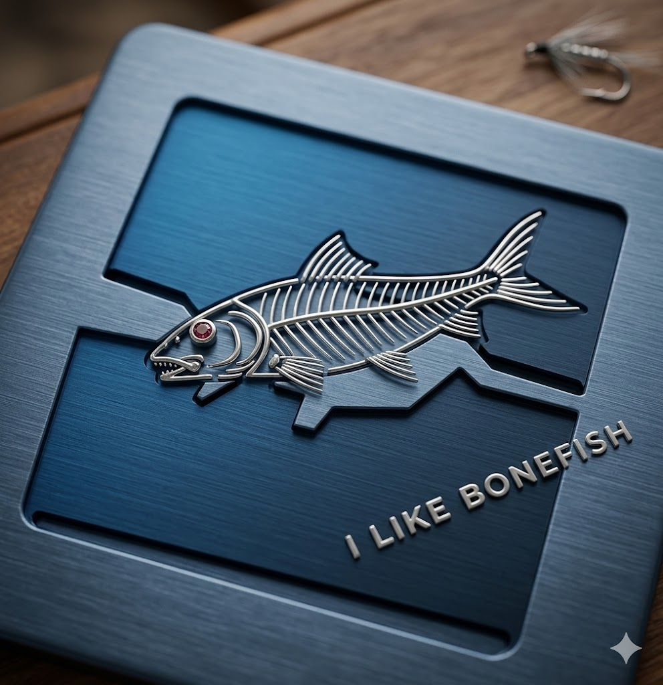
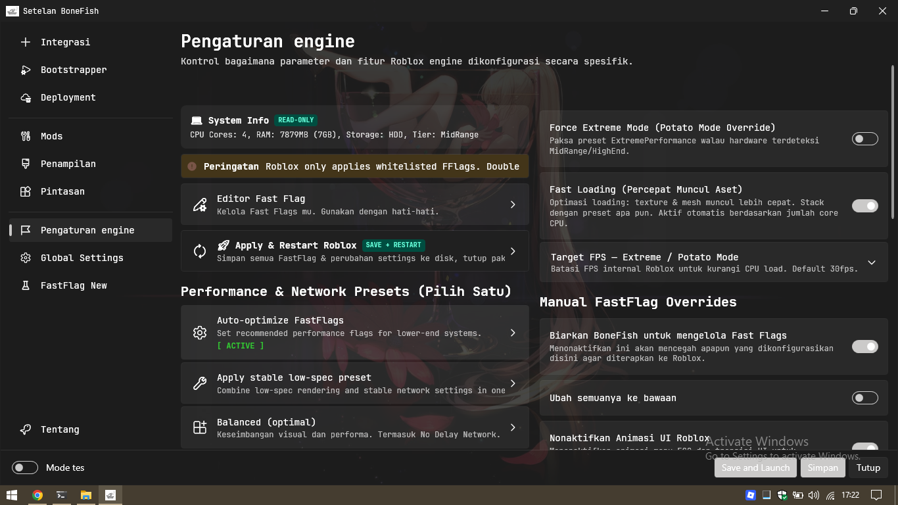
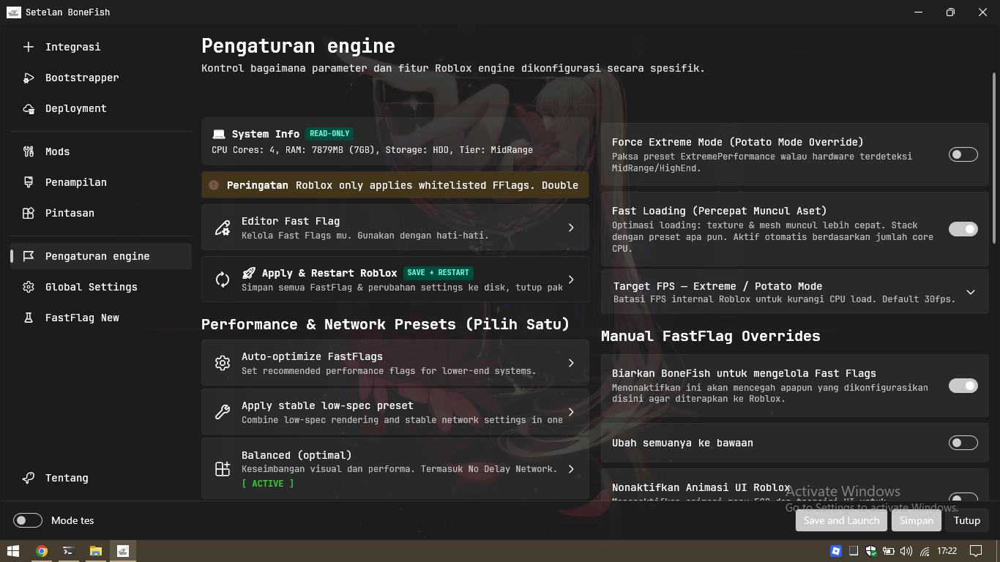
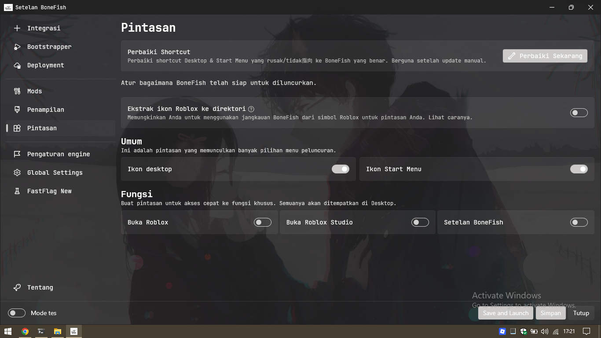
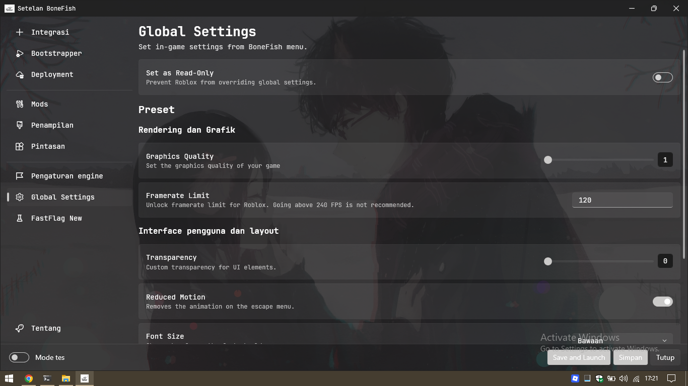

# BoneFish

**A Modern, Feature-Rich Roblox Bootstrapper**

[![License][badge-license]](#)
[![Build Status][badge-actions]](#)
[![Downloads][badge-downloads]][repo-latest]
[![Version][badge-latest]][repo-latest]
[![Discord][badge-discord]][discord-invite]
[![Stars][badge-stars]](#)

[Download Latest Release][repo-latest] · [Visit Website][website] · [Report Bug][repo-new-issue] · [Join Discord][discord-invite]

---

> [!WARNING]
> **Disclaimer:** This project (BoneFish) is a fork of [Bloxstrap][bloxstrap] → [Fishstrap][fishstrap] → **BoneFish**.  
> It is not affiliated with the original Bloxstrap or Fishstrap projects. Use at your own risk.

> [!CAUTION]
> **Official Download:** The only official place to download BoneFish is this GitHub repository.  
> Any other websites offering downloads or claiming to be us are **not controlled by us**.

---

## 🎯 About BoneFish

**BoneFish** (pronounced *bone-fish*) is a powerful custom bootstrapper for Roblox, built on the foundation of [Bloxstrap][bloxstrap] and [Fishstrap][fishstrap]. It's designed to enhance your Roblox experience with modern UI, advanced customization, and performance optimization tools.

> [!NOTE]
> BoneFish is an application for **Windows 10 and above**.  
> For other operating systems, check out [AppleBlox][appleblox] (Mac OS) and [Sober][sober] (Linux).

---

## ✨ Key Features

### 🎨 **Visual Customization**
- **Wallpaper Background System** — Choose from 5 background types (Default, Cool, Quality, Extra, Custom) or enable random mode for a fresh look every launch
- **Custom Wallpaper** — Upload your own images from your PC, with auto-fallback to `images/img/` folder scanning
- **Custom Loading Screens** — Upload your own PNG / JPG / JPEG / BMP images for a personalized loading experience
- **Crosshair Overlay** — In-game custom crosshair with 4 styles (Cross, Dot, Circle, CrossDot), adjustable size (20-200px), opacity (10-100%), 8 color presets, and drag-to-move positioning
- **Global Hotkeys** — Keyboard shortcuts for instant feature toggles: `Ctrl+Shift+C` (Crosshair), `Ctrl+Shift+F` (FPS Monitor)
- **FPS Monitor Overlay** — Real-time FPS display via ETW with color coding (green/yellow/red), draggable positioning, and persistent mode (stays active after game exit)
- **Modern UI** — Clean, minimal design with JetBrains Mono (monospace) font, Lucide-style outline icons, 2-column responsive layout, and dark/light theme support
- **Custom Font, Cursor & Emoji** — Upload custom fonts, choose between classic 2006/2013 cursors, and pick emoji styles (Windows 8.1, Windows 10/11, Catmoji)
- **Bootstrapper Customization** — Multiple bootstrapper styles (Legacy 2008/2011, Vista, Classic, Glass, Fake Byfron), custom icons, and custom title

### ⚡ **Performance & Optimization**
- **FastFlags Manager** — 5 preset performance profiles:
  - 🤖 **Auto-Optimize** — Detects your hardware and applies the best settings automatically
  - 🛡️ **Stable** — Prioritizes stability with network optimizations
  - 🐌 **Ultra Low-Spec** — For old devices (2-core, 2-4GB RAM, Intel HD)
  - 🥔 **Extreme Performance (Potato Mode)** — Maximum FPS with configurable FPS cap (24-60)
  - ⚖️ **Balanced** — Middle ground between performance and visuals
- **Fast Loading Toggle** — Accelerate asset loading by increasing texture compositor parallelism and thread limits (conditional: activates based on CPU core count)
- **Smart Preset Combination** (v7.0.2+) — Presets stack safely: Force Extreme + HDD/low-end is now HDD-aware (keeps ultra-aggressive LOD & disk-friendly compositor jobs), Fast Loading keeps top priority on every launch, and only officially allowlisted flags are written to the client
- **Turbo Mode** — One-click performance burst: forces Extreme Performance preset, applies aggressive FastFlags, resets on restart (non-permanent)
- **HDD/SSD Auto-Detection** — 100% accurate detection via `DeviceIoControl` + `IOCTL_STORAGE_QUERY_PROPERTY`, with automatic HDD Balanced preset for low-end HDD systems
- **Anti Not-Responding System** — 3-layer protection: FastFlags (Roblox allowlist-compliant since v7.0.2), process priority boost, and RAM trimming for low-end devices
- **FPS Monitor** — ETW-based overlay with color-coded FPS, frame time, and Vulkan detection

### 🔧 **Advanced Tools**
- **Detailed Server Information** — Powered by [RoValra][rovalra]'s API: server region, player list, ping, uptime, and location
- **Server History Tracking** — Keep track of servers you've joined during the session, with one-click rejoin
- **Auto-Reconnect After Crash** — Detects Roblox crashes via exit code (NTSTATUS: negative = crash, 0 = normal exit), and offers a "Sambung Ulang" button to rejoin the exact same server (PlaceId + JobId), with automatic fallback to a new server if the old one is full
- **Game Session Manager** — Approve individual background applications for per-session suspension while Roblox runs (Settings → Game Session Manager). New rules are disabled by default, critical/security processes are never touched, suspension is fail-safe when security detection is unavailable, and restore verifies process identity before resuming threads
- **Auto-Cache Cleaner** — Automatic Roblox cache cleanup at startup (configurable max age, max size, with safety check for active Roblox processes)
- **Quick Repair Shortcuts** — One-click verification and repair of Desktop & Start Menu shortcuts
- **Battery Saver Mode** — Skips auto-wallpaper refresh when laptop is on battery (PC desktops without battery auto-hide the toggle)
- **Roblox Studio Support** — Full bootstrapper support for Studio with channel management
- **Auto-Update System** — Automatic update checks with release notifications and background updater
- **Channel Switcher** — Switch between Roblox deployment channels (production, beta, etc.)
- **System Info Panel** — Real-time display of CPU cores, RAM, storage type (HDD/SSD), and system tier right in the UI
- **Custom Bootstrapper Themes** — Advanced XML-based theme system for fully custom bootstrapper dialogs

### 🧪 **Experimental Features**
- **System Tray Integration** — Minimize to tray on close with persistent tray icon
- **Friend Online Notifications** — Get notified when friends come online (Windows native notifications)
- **Notification Sounds** — Audio alerts for notifications
- **Low-End Optimization** — Reduced update frequency for older hardware
- **Network Optimizations** — Better matchmaking with server region prioritization and packet tuning (RakNet rate limits, MTU)
- **Multiple Instance Support** — Launch multiple Roblox instances simultaneously
- **DNS Resilience** — Automatic DNS connectivity testing with backoff on failure
- **Advanced Memory Management** — Low-memory mode, working set trimming, and CPU affinity control for dual-core systems

---

## 📸 Showcase

### Default Interface

*Clean, modern settings panel with organized navigation*

---

### Mods & Customization

*Custom fonts, emojis, cursors, and loading screens*

---

### Visual Themes

*Multiple appearance options and bootstrapper styles*

---

### Experimental Features

*Advanced features: Wallpaper Launcher, FPS Monitor, Notifications*

---

## 🚀 Getting Started

### Installation

1. **Download** the latest release from [Releases][repo-latest]
2. **Extract** the ZIP file to a folder
3. **Run** `BoneFish.exe`
4. **Follow** the setup wizard
5. **Enjoy** your enhanced Roblox experience!

### System Requirements

- **OS:** Windows 10 (1809+) or Windows 11
- **Architecture:** x64 (64-bit)
- **.NET:** .NET 9.0 Runtime (auto-installed if missing)
- **Disk Space:** ~200 MB

---

## 📖 Usage Guide

### Wallpaper Launcher

Navigate to **Experimental** page to:
- **Toggle** random background changes on app launch
- **Select** from the available wallpaper presets instantly
- Changes apply immediately without restart

### Custom Loading Screen

Go to **Mods** page to:
1. Click **Choose** under "Custom Loading Screen"
2. Select an image (PNG, JPG, JPEG, BMP)
3. Preview appears immediately
4. Click **Save** to apply

### FPS Monitor

Enable in **Experimental** page:
- Real-time FPS overlay in-game
- Drag to reposition
- Persists across game sessions

---

## 📋 Changelog

**v7.1.2** *(2026-08-12)* — Toggle persistence fix + Game Session Manager
- **Fix: toggles no longer reset on reload** — manual FastFlags toggles (MSAA, Rendering Mode, Display Scaling, Texture Quality, FRM, Mesh LOD, Animations, Low Memory Mode) now save immediately, and the settings window saves FastFlags on close, so your choices survive a restart
- **Game Session Manager**: approve individual background applications for per-session suspension while Roblox runs. New applications are unchecked by default, critical/security processes are never touched, and restore is verified with a visible summary.
- **Security fail-safe**: unavailable or incomplete security detection suspends zero processes.
- **Session visibility**: the active page lists suspended application names and reports partial suspension/restore failures with exact counts.

**v7.0.6** *(2026-08-10)* — TDR Mitigation Mode for legacy iGPUs
- New toggle reduces freezes/white screens on Intel HD 4000-series: MSAA off, lowest-safe render quality, lowest textures, consistent 30 FPS cap
- Re-entrancy guard prevents preset race conditions on rapid clicks

**v7.0.5** *(2026-08-09)* — Smarter preset combos & clearer system info
- Force Extreme + HDD/low-end now combine instead of overriding each other — HDD-aware LOD and compositor settings survive Extreme Mode, keeping FPS stable on slow storage
- System Info panel shows both your real hardware tier and the active (effective) tier when Force Extreme Mode overrides it
- Cleaner configs: unsupported flags are removed automatically on boot, keeping the app compatible with the latest Roblox client

**v7.0.2** *(2026-08-08)* — Preset combination fix
- Force Extreme + HDD/low-end no longer tanks FPS — LOD distances and texture compositor jobs now adapt to the detected drive type
- Fast Loading toggle no longer gets silently removed on every launch — it is re-applied with top priority at boot
- Removed non-functional FastFlags (telemetry, animation tracks, light fade) — Roblox ignores any flag outside its official allowlist (Sep 2025+); leftover values are still cleaned up on boot

**v7.0.1** *(2026-08-07)* — White-screen audit
- Memory trimming now runs on SSD-only systems; Render-Stall Detector added

**v7.0.0** *(2026-08-06)* — Stability overhaul
- Fixed "Not Responding" freeze when removing a Roblox installation (Hapus → Yes dialog)
- "NASA-grade" network optimizations extended to low-end paths

---

## 🎬 YouTube Content Script

BoneFish includes a detailed **YouTube content script** for creators who want to showcase the application.

📄 **[View Full Script](YOUTUBE-CONTENT-SCRIPT.md)**

The script includes:
- Complete video outline (15-20 minutes)
- Shot-by-shot breakdown with timestamps
- Voice-over suggestions in Indonesian
- B-roll requirements and editing tips
- Music recommendations
- Video description template with hashtags
- Thumbnail design tips

Perfect for creating professional tutorials and reviews!

---

## 🤝 Contributing

We welcome contributions! Here's how you can help:

1. **Fork** the repository
2. **Create** a feature branch (`git checkout -b feature/AmazingFeature`)
3. **Commit** your changes (`git commit -m 'Add some AmazingFeature'`)
4. **Push** to the branch (`git push origin feature/AmazingFeature`)
5. **Open** a Pull Request

### Contribution Guidelines

- Follow the existing code style
- Test your changes thoroughly
- Update documentation if needed
- Be respectful and constructive

---

## 🐛 Bug Reports & Support

Found a bug? Have a question?

- **GitHub Issues:** [Open an issue here][repo-new-issue]
- **Discord Support:** Join our [Discord server][discord-invite] and post in `#support-and-bugs`

When reporting bugs, please include:
- BoneFish version
- Windows version
- Steps to reproduce
- Error messages/screenshots
- Log files (if applicable)

---

## 🙏 Special Thanks

### Core Contributors
- **[pizzaboxer](https://github.com/pizzaboxer)** — Original creator of Bloxstrap
- **[Valra](https://github.com/NotValra)** — RoValra API for server information
- **[Fishstrap Team](https://github.com/fishstrap)** — Foundation for many features
- **[JetBrains](https://www.jetbrains.com/lp/mono/)** — JetBrains Mono font (SIL OFL)
- **[Lucide Icons](https://lucide.dev)** — Open-source icon set (ISC License)

### Technology Stack
- **[WPF UI](https://github.com/lepoco/wpfui)** — Modern UI controls
- **[CommunityToolkit.Mvvm](https://github.com/CommunityToolkit/dotnet)** — MVVM framework
- **[AvalonEdit](https://github.com/icsharpcode/AvalonEdit)** — Code editor component
- **[DiscordRichPresence](https://github.com/Lachee/discord-rpc-csharp)** — Discord integration
- **[SharpVectors](https://github.com/ElinamLLC/SharpVectors)** — SVG rendering (for Lucide Icons)

### Community
- All contributors who submitted issues, PRs, and feedback
- Discord community members for testing and suggestions
- Everyone who uses and supports BoneFish

---

## 📜 License

This project is licensed under the **MIT License**.  
See the [LICENSE](LICENSE) file for details.

BoneFish is a fork of [Bloxstrap][bloxstrap] by pizzaboxer (MIT).  
See [LICENSE.Bloxstrap](LICENSE.Bloxstrap) for the original Bloxstrap license.

**TL;DR:**
- ✅ Free for any use (personal & commercial)
- ✅ Modify and redistribute (with attribution)
- ✅ Private use / fork freely
- ❌ Hold us liable for any damages
- ❌ Claiming as your own work

---

## ⚠️ Disclaimer

BoneFish is a third-party modification and is not endorsed by or affiliated with Roblox Corporation.  
Use at your own risk. We are not responsible for any account actions taken by Roblox.

**Roblox** is a registered trademark of Roblox Corporation.

---

**Made with ❤️ by the BoneFish Team**

[⬆ Back to Top](#bonefish)

---

<!-- Badge Links -->
[badge-license]:   https://img.shields.io/badge/license-MIT-blue?style=flat-square
[badge-actions]:   https://img.shields.io/github/actions/workflow/status/BoneFishStudio/BoneFish/ci-release.yml?style=flat-square&label=build
[badge-downloads]: https://img.shields.io/github/downloads/BoneFishStudio/BoneFish/total?style=flat-square
[badge-latest]:    https://img.shields.io/github/v/release/BoneFishStudio/BoneFish?style=flat-square
[badge-discord]:   https://img.shields.io/discord/1299397064165429360?style=flat-square&logo=discord&logoColor=white&label=discord&color=4d3dff
[badge-stars]:     https://img.shields.io/github/stars/BoneFishStudio/BoneFish?style=flat-square&color=dd9900

<!-- Repository Links -->
[repo-latest]:    https://github.com/BoneFishStudio/BoneFish/releases/latest
[repo-new-issue]: https://github.com/BoneFishStudio/BoneFish/issues/new/choose
[discord-invite]: https://discord.gg/SRs5zb9BJd

<!-- External Links -->
[bloxstrap]:  https://bloxstraplabs.com
[fishstrap]:  https://github.com/fishstrap/fishstrap
[appleblox]:  https://github.com/AppleBlox/appleblox
[sober]:      https://sober.vinegarhq.org
[rovalra]:    https://www.rovalra.com
[website]:    https://bonefishstudio.vercel.app
